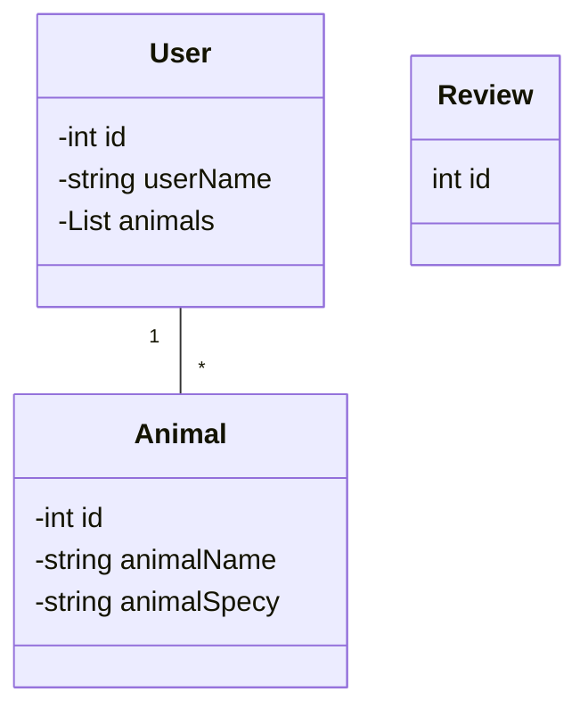

## Application de gardiennage d'animaux 

```mermaid
 classDiagram
      User "1" -- "*" Animal
      class User {
            -int id
            -string userName
            -List<Animal> animals
      }
      class Animal {
		-int id
		-string animalName
		-string animalSpecy
	}
      class Review {
            int id
      }
```
