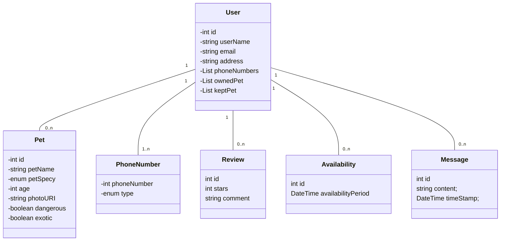

## Application de gardiennage d'animaux 

#### Business logic

#### Liens
Syntaxe pour [Markdown](https://www.markdownguide.org/basic-syntax/)

Syntaxe pour les diagrammes de classe [Mermaid](https://mermaid-js.github.io/mermaid/#/classDiagram)
